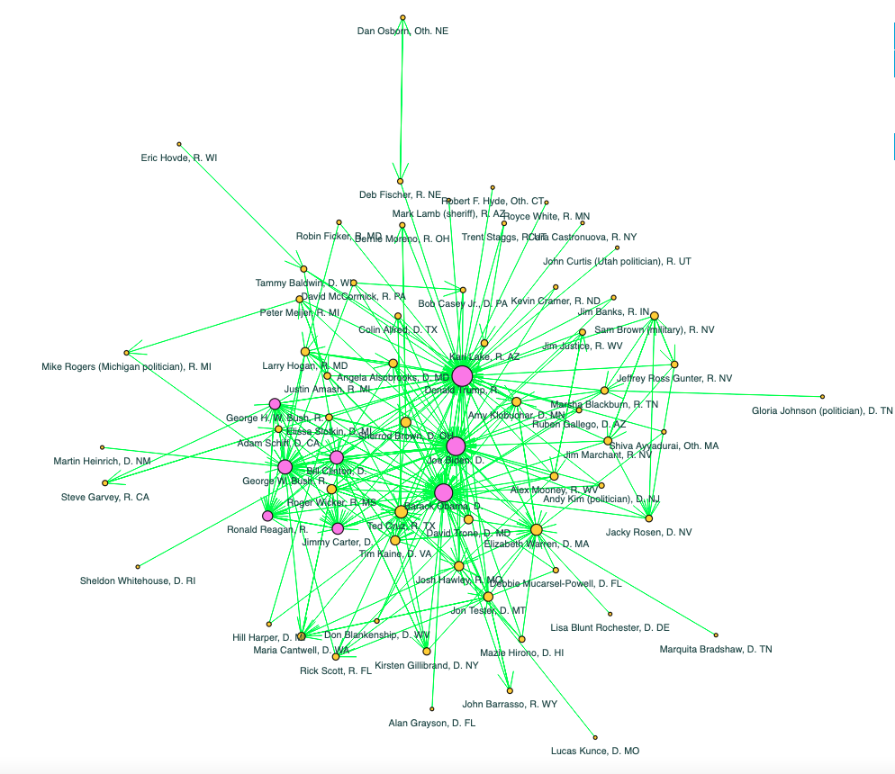

## 2. Graphs

The creation of hyperlink graphs is a crucial step in visualizing the relationships and connections among the candidates for the 2024 U.S. Senate and House of Representatives elections. By mapping out the hyperlinks between the Wikipedia pages of the candidates, we can analyze the interconnectedness and network structure of the political landscape.

### 2.1. Obtaining Edge Values

To begin, the validated Wikipedia pages for each candidate were used as the basis for constructing each hyperlink graph. Each Wikipedia page in both dataframes was inspected to extract hyperlinks pointing to other Wikipedia pages. These hyperlinks represent connections between different candidates. To obtain these hyperlinks, a for-loop utilizing the “wikipediaapi.Wikipedia” Python library was used to systematically traverse each candidate’s Wikipedia page and compile a list of hyperlinks. Within the loop, we retrieved, sorted, and filtered out self-referencing links shown on each candidate's page. We stored the edge pairs in the hyperlink list when we found intersecting links with the validated Wikipedia pages.This approach allowed us to identify and capture all outgoing hyperlinks between candidates’ Wikipedia pages to be used as the edges in our network graph.

### 2.2. Building the Graphs

The two hyperlink graphs were constructed using the library in Python [NetworkX](https://networkx.org/), which is designed for the creation, manipulation, and study of complex networks. Both the Senate candidate’s graph (Gs) and the House candidate’s graph (Gh) were initiated as a NetworkX DiGraph (directed graph). Each candidate was represented by his/her Wikipedia page as a node in their respective graph, and the hyperlinks between their Wikipedia pages (nodes) were represented as edges connecting these nodes.

* **Nodes**: Each candidate with a validated Wikipedia page was added as a node in the graph. Additional attributes such as party affiliation, office, incumbency status, and state were assigned to each node to provide context and facilitate further analysis.
* **Edges**: Hyperlinks extracted from the Wikipedia pages were used to create directed edges between nodes. These edges indicate a hyperlink from one candidate's Wikipedia page to another, capturing the nature of their interconnectedness.
  
### 2.3 Graph Plots

The constructed graphs were visualized using Python library [Holoviews](https://www.holoviews.org/). Different visual attributes were used to enhance the clarity and interpretability of the graphs. Nodes were sized by their degree.

#### The graph of Senate candidates

  
   
  <b>Figure 1</b>: Senate candidates hyperlink graph (<a href="https://mamaocoder.github.io/2024candidates_project/plots/SenateGraph1.html">interactive graph</a>).

Compare the graph statistics of the current Senate graph, which includes the eight Presidents, with those of the Senate graph excluding the Presidents:

| Graph statistic                         | With Presidents                    | Without presidents                 |
|:----------------------------------------|:-----------------------------------|:-----------------------------------|
| Order                                   | 68                                 | 58                                 |
| Size                                    | 246                                | 581                                |
| Density                                 | 0.054                              | 0.176                              |
| Average degree                          | 3.618                              | 10.017                             |
| Transitivity                            | 0.555                              | 0.923                              |
| Reciprocity                             | 0.358                              | 0.957                              |
| Diameter                                | Undefined (not strongly connected) | Undefined (not strongly connected) |
| Number of weakly connected components   | 1                                  | 2                                  |
| Number of strongly connected components | 39                                 | 16                                 |

#### The graph of reciprocated Senate candidates

#### The graph of House candidates

#### The graph of reciprocated House candidates
