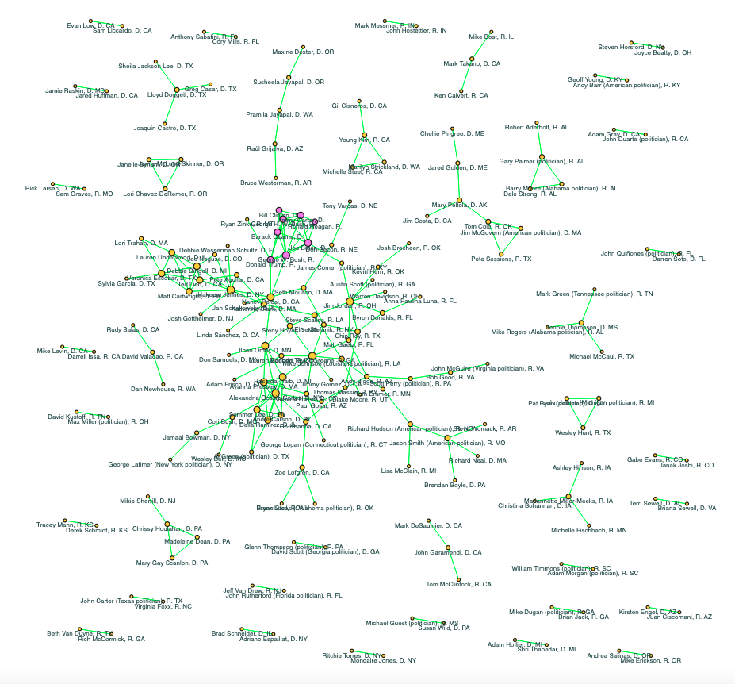

## 2. Graphs

The creation of hyperlink graphs is a crucial step in visualizing the relationships and connections among the candidates for the 2024 U.S. Senate and House of Representatives elections. By mapping out the hyperlinks between the Wikipedia pages of the candidates, we can analyze the interconnectedness and network structure of the political landscape.

### 2.1. Obtaining Edge Values

To begin, the validated Wikipedia pages for each candidate were used as the basis for constructing each hyperlink graph. Each Wikipedia page in both dataframes was inspected to extract hyperlinks pointing to other Wikipedia pages. These hyperlinks represent connections between different candidates. To fetch these hyperlinks, we utilized "wikipediaapi" Python library to traverse each candidate’s Wikipedia page and compile a list of hyperlinks. In the fetching process, we parsed the HTML content with BeautifulSoup. By searching all paragraph and main content table elements, we identified links with anchor tags (<a>) with valid href attributes. We then excluded certain links, such as those within non-infobox tables, help links, and specific top-level links, to get a cleaned list of valid Wikipedia page titles.

With this method, we created two dictionaries: one to store all the clean hyperlinks found on each candidate's page and another to store hyperlinks from a candidate's page that point to other candidates' pages. We used the latter to construct the edges in this network analysis of interconnectedness.

### 2.2. Building the Graphs

The two hyperlink graphs were constructed using the library in Python [NetworkX](https://networkx.org/), which is designed for the creation, manipulation, and study of complex networks. Both the Senate candidate’s graph (Gs) and the House candidate’s graph (Gh) were initiated as a NetworkX DiGraph (directed graph). Each candidate was represented by his/her Wikipedia page as a node in their respective graph, and the hyperlinks between their Wikipedia pages (nodes) were represented as edges connecting these nodes.

* **Nodes**: Each candidate with a validated Wikipedia page was added as a node in the graph. Additional attributes such as party affiliation, office, incumbency status, and state were assigned to each node to provide context and facilitate further analysis.
* **Edges**: Hyperlinks extracted from the Wikipedia pages were used to create directed edges between nodes. These edges indicate a hyperlink from one candidate's Wikipedia page to another, capturing the nature of their interconnectedness.
  
### 2.3 Elementary Graph Statistics and Graph Plots

The constructed graphs were visualized using Python library [Holoviews](https://www.holoviews.org/). Different visual attributes were used to enhance the clarity and interpretability of the graphs. Nodes were sized by their degree.

### 2.3.1 The graph of Senate candidates (including Presidents)

  
   
  <b>Figure 1</b>: Senate candidates hyperlink graph (<a href="https://mamaocoder.github.io/2024candidates_project/plots/SenateGraph1.html">interactive graph</a>).

Compare the graph statistics of the Senate graph, which includes the eight Presidents, with those of the Senate graph excluding the Presidents:

| Senate graph statistic                  |   With Presidents |   Without presidents |
|:----------------------------------------|------------------:|---------------------:|
| Order                                   |            68     |               58     |
| Size                                    |           246     |              581     |
| Density                                 |             0.054 |                0.176 |
| Average degree                          |             3.618 |               10.017 |
| Transitivity                            |             0.555 |                0.923 |
| Reciprocity                             |             0.358 |                0.957 |
| Number of weakly connected components   |             1     |                2     |
| Number of strongly connected components |            39     |               16     |

### 2.3.2 The graph of reciprocated Senate candidates (including Presidents)

  
   
  <b>Figure 2</b>: Reciprocated Senate candidates hyperlink graph (<a href="https://mamaocoder.github.io/2024candidates_project/plots/RecSenateGraph1.html">interactive graph</a>).

Compare the graph statistics of the reciprocated Senate graph, which includes the eight Presidents, with those of the reciprocated Senate graph excluding the Presidents:

| Reciprocated Senate graph statistic   |   With Presidents |   Without presidents |
|:--------------------------------------|------------------:|---------------------:|
| Order                                 |            35     |               43     |
| Size                                  |            44     |              278     |
| Density                               |             0.074 |                0.308 |
| Average degree                        |             1.257 |                6.465 |
| Transitivity                          |             0.565 |                0.937 |
| Number of connected components        |             8     |                1     |
| Average clustering coefficient        |             0.159 |                0.748 |

### 2.3.3 The graph of House candidates (including Presidents)

  
   
  <b>Figure 3</b>: House candidates hyperlink graph (<a href="https://mamaocoder.github.io/2024candidates_project/plots/HouseGraph1.html">interactive graph</a>).

Compare the graph statistics of the House graph, which includes the eight Presidents, with those of the House graph excluding the Presidents:

| House graph statistic                   |   With Presidents |   Without presidents |
|:----------------------------------------|------------------:|---------------------:|
| Order                                   |           427     |              442     |
| Size                                    |          1613     |           116721     |
| Density                                 |             0.009 |                0.599 |
| Average degree                          |             3.778 |              264.075 |
| Transitivity                            |             0.343 |                0.995 |
| Reciprocity                             |             0.247 |                0.99  |
| Number of weakly connected components   |             5     |                7     |
| Number of strongly connected components |           211     |               46     |

### 2.3.4 The graph of reciprocated House candidates (including Presidents)

  
   
  <b>Figure 4</b>: Reciprocated House candidates hyperlink graph (<a href="https://mamaocoder.github.io/2024candidates_project/plots/RecHouseGraph1.html">interactive graph</a>).

Compare the graph statistics of the reciprocated House graph, which includes the eight Presidents, with those of the reciprocated House graph excluding the Presidents:

| Reciprocated House graph statistic   |   With Presidents |   Without presidents |
|:-------------------------------------|------------------:|---------------------:|
| Order                                |           179     |              403     |
| Size                                 |           199     |            57795     |
| Density                              |             0.012 |                0.713 |
| Average degree                       |             1.112 |              143.412 |
| Transitivity                         |             0.382 |                0.998 |
| Number of connected components       |            38     |                9     |
| Average clustering coefficient       |             0.165 |                0.897 |
